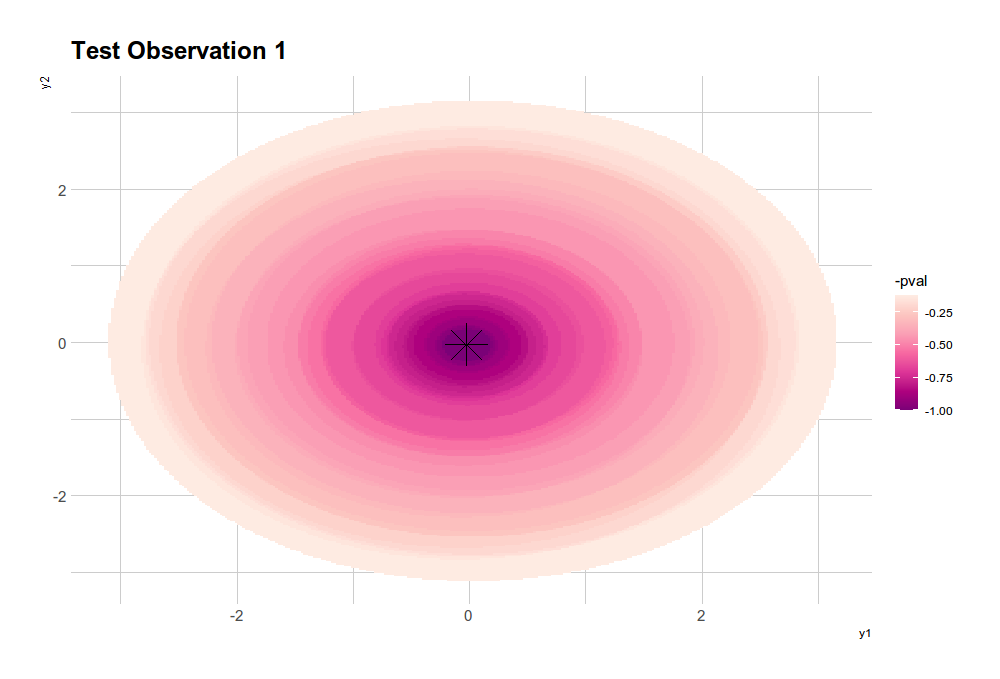

# Conformal Inference Prediction Regions for Multivariate Response Regression

  

   

Welcome to the world of accurate and versatile regression analysis with the conformalInference.multi R package! 
This repository hosts a powerful tool that allows you to generate valid prediction regions at levels 1-α or 1-2α in multivariate response regression. What sets this package apart is its ability to handle a wide range of data distributions, eliminating the need for Gaussian assumptions commonly found in traditional methods.

The package releases the freedom to perform regression analysis without being constrained by the requirement of assuming Gaussian data. With conformalInference.multi, you can embrace a non-parametric approach that accommodates various data distributions encountered in real-world scenarios. This versatility empowers you to gain robust insights and make accurate predictions in diverse regression tasks.

Developed as part of a Master's thesis in Mathematical Engineering at Politecnico di Milano, this package extends the renowned Conformal Prediction methods for univariate response regression to handle multivariate response data.

## Code Structure

The conformalInference.multi package is thoughtfully organized into three main families of functions, designed to simplify your regression analysis workflow:

1. Prediction methods: These functions compute prediction regions, enabling you to make accurate predictions with confidence.
2. Regression methods: This family of functions encompasses various regression algorithms. You have the flexibility to use built-in regression methods or incorporate your own custom-coded algorithms tailored to your specific needs.
3. Plot methods: Visualize and interpret the output of prediction methods with ease using the plot functions provided by this package.

By separating the prediction and regression methods, conformalInference.multi empowers you to tailor your regression analysis to suit your unique requirements, providing ultimate flexibility and customization.

## Key Functions

The conformalInference.multi package offers an array of essential functions that enhance your regression analysis capabilities. Some notable functions include:

 

| Syntax                    | Description                               |
| ------------------------- | ----------------------------------------- |
| conformal.multidim.full   | Computes Full Conformal prediction regions |
| conformal.multidim.jackplus| Computes Jackknife+ prediction regions     |
| conformal.multidim.split  | Computes Split Conformal prediction regions|
| conformal.multidim.msplit | Computes Multi Split Conformal prediction regions|
| elastic.funs              | Builds elastic net regression models       |
| lasso.funs                | Builds lasso regression models             |
| lm_multi                  | Builds linear regression models            |
| mean_multi                | Builds regression functions with mean      |
| plot_multidim             | Plots the output of prediction methods     |
| ridge.funs                | Builds ridge regression models             |

## Detailed Description

To gain a comprehensive understanding of the theoretical foundations and practical implementation of conformalInference.multi, we invite you to explore the detailed analysis and case studies presented in the Master's thesis paper. The paper delves into the intricacies of the package, providing valuable insights and practical guidance. You can access the paper at the following [link](https://arxiv.org/abs/2106.01792).

## Acknowledgments

We would like to express our sincere gratitude to the following individuals for their invaluable contributions and unwavering support throughout the development of this project:

- **Prof. Simone Vantini** - _Politecnico di Milano_
- **Dr. Jacopo Diquigiovanni** - _Research collaborator_
- **Dr. Matteo Fontana** - _Research collaborator_
- **Prof. Aldo Solari** - _Università Bicocca di Milano_

Their knowledge, expertise, and encouragement have been instrumental in shaping and refining the conformalInference.multi package, making it an exceptional tool for regression analysis in non-Gaussian data scenarios.

With the conformalInference.multi package, you can confidently perform regression analysis without the constraint of assuming Gaussian data. Embrace the flexibility and robustness of this non-parametric approach, explore the provided functions, and unleash the full potential of regression analysis in a variety of data distributions.
